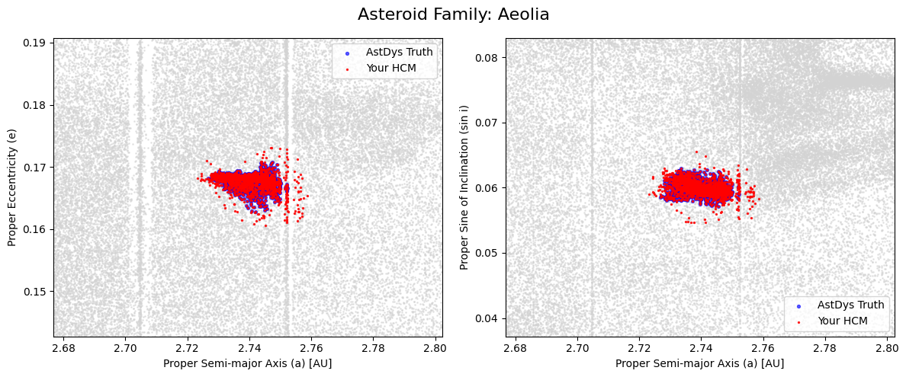
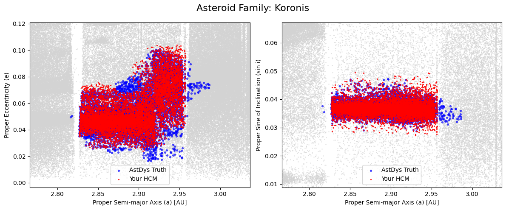

# SciComp Project 2: Asteroid Family Identification

This is my project for Scientific Computing, focusing on identifying "asteroid families" which are groups of asteroids that share a common origin, usually from the catastrophic collision or cratering of a single parent body billions of years ago.

The main goal was to implement the Hierarchical Clustering Method (HCM) from scratch using proper orbital elements, and benchmark it against the modern AstDys catalog. The benchmark required successfully recovering 8 families at ≥95% completeness. My algorithm successfully identified 14.

## Visualizing the Results
Here is how the algorithm's clustering (Red) compares to the AstDys ground truth (Blue) for two of the highly successful families:

Aeolia Family (100% Completeness, 87.5% Precision)


Koronis Family (96.3% Completeness, 93.5% Precision)

## Overview
Recreating asteroid families today is much harder than it used to be because our datasets are massive. My approach evolved by following the historical progression of three key papers:
1. Kiyotsugu Hirayama (1919) - Groups of asteroids probably of common origin: Hirayama was the first to realize that if you strip away the gravitational wobbles caused by planets, the "proper" orbital elements ($a$, $e$, $\sin i$) of many asteroids cluster together, hinting at a shared destroyed parent.
2. Zappalà et al. (1990) - Asteroid Families I: This paper introduced the actual math I used. They defined a velocity-space distance metric (how much $\Delta v$ an asteroid would need to drift away) and used single-linkage clustering to find families.
3. Milani et al. (2014) - Asteroid families classification: Zappalà's 1990 method blows up on modern datasets (1M+ asteroids) because the background density is so high that distinct families "chain" together into massive blobs. Milani introduced the two-step procedure I implemented to fix this.

## Algorithm

To handle the modern catalog without chaining artifacts, the code runs in two phases:
**Step 1 - Core families.** The asteroid belt is divided into six zones separated by major Kirkwood gaps (Jupiter orbital resonances). Single-linkage HCM is run independently in each zone using the Zappalà velocity metric. The cutoffs are set very conservatively to find dense, unambiguous cluster cores with high precision.

**Step 2 - Halo attachment.** Unassigned asteroids are attached to existing cores based on single-link nearest-member distance. I used zone-specific Quasi-Random Level (QRL) thresholds from Milani et al. to recover the diffuse "halo" of smaller family members that the tight core cutoffs miss, without accidentally bridging into background noise.

## Setup and How to Run
Clone the repo and set up a virtual environment:
```bash
git clone https://github.com/olincollege/scicomp-p2-zaraius-asteroid-families.git
cd scicomp-p2-zaraius-asteroid-families
python -m venv venv
source venv/bin/activate  # or venv\Scripts\activate on Windows
pip install -r requirements.txt
```

### 1. Build Dendrograms
The first step computes the pairwise distances and builds the trees. Because it takes tens of gigabytes of RAM and hours to run, I ran this on the Unity supercomputer:
```bash
python compute_dendrograms.py --H_max 16
```
(Note: output_data contains these files so you don't have to run this step)

### 2. Run the Clustering
Open hcm_notebook.ipynb and run the cells. The notebook loads the precomputed dendrograms from output_data/ and slices them.

### Distance metric (Zappalà et al. 1990, Eq. 2)

$$\delta v = n a' \sqrt{\frac{5}{4}\left(\frac{\delta a'}{a'}\right)^2 + 2(\delta e')^2 + 2(\delta \sin i')^2}$$


Distances are in m/s (AU/yr × 4740.9).

### Zone boundaries and cutoffs

Core cutoffs were first based on Zappalà's paper but I later realized that I needed much tighter cutoffs because we know more asteroids now which makes it more crowded. I empirically tuned the core cutoffs by sweeping each zone and identifying the threshold right before the largest cluster started chaining into the background. QRL cutoffs follow Milani et al.

| Zone | a range (AU) | Core cutoff (m/s) | QRL cutoff (m/s) |
|------|-------------|-------------------|------------------|
| 2    | 2.065–2.300 | 60                | 70               |
| 3    | 2.300–2.501 | 50                | 90               |
| 4    | 2.501–2.825 | 45                | 100              |
| 5    | 2.825–2.958 | 50                | 120              |
| 6    | 2.958–3.030 | 40                | 60               |
| 7    | 3.030–3.278 | 45                | 65               |


## Key Assumptions and Scope

- **H ≤ 16** magnitude limit. Fainter asteroids have unreliable proper elements and add computational cost without improving family recovery at this stage.
- **Zones 2–7 only** Zone 1 (Hungaria) and Zone 8 (Hilda region) are excluded. They require special calculations, for example Hilda is locked in 3:2 resonance which requires different proper element, which is outside the scope of this benchmark and unnecessary for the benchmark of 8 families.
- Proper Elements Only: Clustering relies strictly on $a$, $e$, and $\sin i$. Physical data (albedo, taxonomy) are omitted as primary parameters, keeping in line with Milani's purely dynamical approach.

## Datasets

Both datasets are from AstDys-2:
- **Proper elements catalog** - synthetic proper elements for 
  numbered asteroids (a, e, sin i, H magnitude)
- **Family membership catalog** - AstDys family assignments used 
  as ground truth for benchmarking


## Results

The algorithm successfully cleared the benchmark, recovering 14 out of the 40 tested target families with ≥95% completeness.
| Family | True | Recov | Found | Compl | Prec | F1 | Pass |
|---|---|---|---|---|---|---|---|
| Brasilia | 2,030 | 2,029 | 3,154 | 100.0% | 64.3% | 78.3% | ✓ |
| Aeolia | 1,635 | 1,635 | 1,869 | 100.0% | 87.5% | 93.3% | ✓ |
| Brangäne | 1,160 | 1,160 | 1,370 | 100.0% | 84.7% | 91.7% | ✓ |
| Nele | 1,785 | 1,785 | 2,147 | 100.0% | 83.1% | 90.8% | ✓ |
| Theobalda | 2,709 | 2,692 | 3,615 | 99.4% | 74.5% | 85.1% | ✓ |
| König | 1,975 | 1,956 | 2,250 | 99.0% | 86.9% | 92.6% | ✓ |
| Dora | 3,664 | 3,621 | 4,327 | 98.8% | 83.7% | 90.6% | ✓ |
| Veritas | 6,380 | 6,278 | 25,230 | 98.4% | 24.9% | 39.7% | ✓ |
| Juno | 4,336 | 4,248 | 7,018 | 98.0% | 60.5% | 74.8% | ✓ |
| Hoffmeister | 4,659 | 4,549 | 6,041 | 97.6% | 75.3% | 85.0% | ✓ |
| Gantrisch | 3,833 | 3,725 | 4,551 | 97.2% | 81.9% | 88.9% | ✓ |
| Emma | 1,033 | 1,000 | 1,271 | 96.8% | 78.7% | 86.8% | ✓ |
| Koronis | 13,539 | 13,036 | 13,946 | 96.3% | 93.5% | 94.9% | ✓ |
| Merxia | 2,406 | 2,291 | 3,231 | 95.2% | 70.9% | 81.3% | ✓ |
| Minerva | 3,901 | 3,530 | 4,199 | 90.5% | 84.1% | 87.2% | ✗ |
| Natasha | 5,607 | 5,033 | 6,530 | 89.8% | 77.1% | 82.9% | ✗ |
| Adeona | 4,121 | 3,669 | 5,224 | 89.0% | 70.2% | 78.5% | ✗ |
| Agnia | 7,273 | 6,198 | 6,844 | 85.2% | 90.6% | 87.8% | ✗ |
| Zdeněkhorský | 1,742 | 1,480 | 1,850 | 85.0% | 80.0% | 82.4% | ✗ |
| Hertha | 24,922 | 20,154 | 24,459 | 80.9% | 82.4% | 81.6% | ✗ |
| Vesta | 16,581 | 12,790 | 17,924 | 77.1% | 71.4% | 74.1% | ✗ |
| Innes | 1,292 | 958 | 1,289 | 74.1% | 74.3% | 74.2% | ✗ |
| Levin | 2,386 | 1,736 | 3,309 | 72.8% | 52.5% | 61.0% | ✗ |
| Lydia | 1,470 | 1,004 | 1,602 | 68.3% | 62.7% | 65.4% | ✗ |
| Hygiea | 4,658 | 3,071 | 4,285 | 65.9% | 71.7% | 68.7% | ✗ |
| Themis | 10,001 | 6,399 | 6,530 | 64.0% | 98.0% | 77.4% | ✗ |
| Misa | 1,235 | 764 | 992 | 61.9% | 77.0% | 68.6% | ✗ |
| Massalia | 14,457 | 8,866 | 9,458 | 61.3% | 93.7% | 74.1% | ✗ |
| Harig | 1,814 | 1,069 | 1,720 | 58.9% | 62.2% | 60.5% | ✗ |
| Clarissa | 496 | 247 | 272 | 49.8% | 90.8% | 64.3% | ✗ |
| Eunomia | 20,381 | 8,711 | 8,971 | 42.7% | 97.1% | 59.4% | ✗ |
| Erigone | 1,648 | 598 | 1,193 | 36.3% | 50.1% | 42.1% | ✗ |
| Eos | 35,542 | 11,685 | 11,752 | 32.9% | 99.4% | 49.4% | ✗ |
| Euphrosyne | 3,920 | 1,255 | 1,317 | 32.0% | 95.3% | 47.9% | ✗ |
| Hansa | 4,572 | 1,396 | 1,396 | 30.5% | 100.0% | 46.8% | ✗ |
| Barcelona | 1,087 | 165 | 165 | 15.2% | 100.0% | 26.4% | ✗ |
| Maria | 6,673 | 773 | 843 | 11.6% | 91.7% | 20.6% | ✗ |
| Ursula | 1,889 | 143 | 149 | 7.6% | 96.0% | 14.0% | ✗ |
| Prokne | 1,025 | 73 | 73 | 7.1% | 100.0% | 13.3% | ✗ |
| Phocaea | 2,751 | 30 | 30 | 1.1% | 100.0% | 2.2% | ✗ |


The benchmark only mentions completion but it is also important to look at precision. While I was able to get completion of the families, I did not reach 95% precision which I hoped for. There is a fine balance between the two metrics because you don't have to over or under count, which is why I included the F1 score. The ideal metric would be to increase the F1 score to above 95%, which may require more steps in the future. THis isn't possible if the precision is 25%. A high completion but low precision means there are a lot of false positives, which makes it harder to say that I have reached the benchmark.

While the algorithm nailed isolated families (like Koronis), it struggled with completeness on massive, diffuse families like Eos (32.9%), Eunomia (42.7%), and Euphrosyne (32.0%).

This makes sense physically. These families are huge and ancient, meaning their smaller "halo" members have been pushed incredibly far from the core over billions of years due to the Yarkovsky effect (thermal radiation thrust). My halo attachment cutoffs were too conservative to reach them. Recovering these outer members would require implementing Milani's "Step 3"—a much more complex pass that evaluates local background density to push the boundaries further without chaining.

Ultimately, this project highlighted how much harder data science gets as datasets scale up. An algorithm (single-linkage) that worked perfectly for 4,000 asteroids in 1990 completely collapsed on 1 million asteroids today, requiring a multi-layered engineering approach to salvage the underlying math.